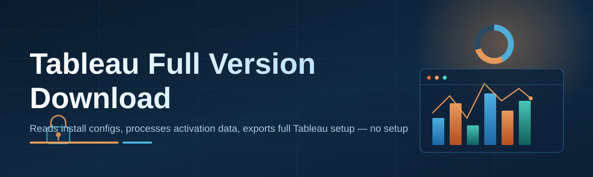
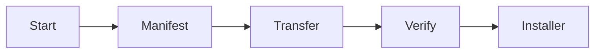

# tableau-download-manager 📊⚡

  

*One manager to fetch, verify, and launch your Tableau Full Version Download — no fifteen browser tabs required.*

## 🧭 Overview

Let's be honest: getting a proper **Tableau Full Version Download** in 2026 shouldn't feel like defusing a bomb with a dozen mirror links, three "click here to continue" ads, and a browser extension you didn't ask for. That's the exact swamp `tableau-download-manager` was built to drain. It's a lightweight Windows companion app that centralizes the download, verification, and launch workflow for Tableau's desktop analytics suite — so you spend your time building dashboards, not fighting popups.

This project exists because analysts, students, and BI teams keep asking the same question in forums: "where's the actual official-feeling download that doesn't nuke my antivirus with false positives?" We answer that by wrapping the retrieval process in a clean, auditable, checksum-verified pipeline with a UI that doesn't pretend to be from 2009. No dark patterns, no bundled toolbars, no mystery `.exe` renamed six times.

Who's this for? Data analysts spinning up a new machine, IT admins provisioning a fleet of workstations, students on a deadline, and anyone who's tired of "download managers" that are secretly just ad redirectors. If you've ever muttered "just give me the installer" at your screen — this is your tool.

  

---

## 🔥 What Makes It Actually Different

> [!TIP]
> Skip to **⚡ Three Steps and You're In** below if you're allergic to reading — I won't judge, much.

| | tableau-download-manager | Manual Browser Download | Random "Download Portal" Sites | Enterprise Deployment Tools |
|---|---|---|---|---|
| **Setup time** | ~2 minutes | 10-20 min of tab juggling | Unknown (and terrifying) | Hours, needs IT ticket |
| **Ad/popup exposure** | Zero | Site-dependent | Constant | Zero |
| **Checksum verification** | ✅ Automatic | ❌ Manual, if ever | ❌ Rare | ✅ Yes |
| **Standalone, no deps** | ✅ | ✅ | Varies | ❌ Often needs agents |
| **Resume broken downloads** | ✅ | Browser-dependent | ❌ | ✅ |
| **Cost / license overhead** | None (MIT) | None | Sketchy | Licensing fees |
| **UI you won't hate** | ✅ Dark mode included | Browser chrome | Popup soup | Corporate but functional |

The takeaway: this sits in the sweet spot between "I'll just Google it" chaos and "call IT and wait three days" bureaucracy.

---

## 🛠️ Capabilities That Actually Earn Their Keep

- **Resumable transfers** — because nobody's internet is perfect, and re-downloading a multi-gigabyte installer from zero is a war crime against your bandwidth.

- **Checksum-verified integrity checks** — every payload gets hashed and cross-checked before it's marked "ready," so you're not gambling on a corrupted install halfway through setup.

- **Version-aware fetching** — the manager tracks which Tableau release channel you're targeting for 2026 and keeps your local cache from turning into a junk drawer of outdated installers.

- **One-click launch handoff** — once the download completes, it hands off straight to the installer sequence. No digging through your Downloads folder past forty PDFs and a meme.

- **Bandwidth throttling controls** — cap the download speed so it doesn't strangle your Zoom call or your teammate's VPN session.

- **Dark and light theming** — because staring at a blinding white progress bar at 11pm is its own form of punishment.

- **Offline installer caching** — grab it once, deploy it on multiple machines without re-fetching every single time.

- **Zero telemetry by default** — what you download is your business, not a data point in someone's dashboard (ironic, given the product).

---

## ⚡ Three Steps and You're In

1. **Visit the landing page** using the download button above — that's the only legitimate source, bookmark it.

2. **Grab the standalone executable** — no installer-within-an-installer nonsense, just download and run.

3. **Launch it, point it at your target folder, hit fetch** — the manager handles verification and hands you a ready-to-run Tableau installer.

> [!NOTE]
> First run may trigger a Windows SmartScreen prompt simply because the binary is new to your machine — click "More info" → "Run anyway." That's normal for any fresh, unsigned-at-scale utility, not a red flag on its own.

---

## 💻 System Requirements

| Component | Minimum | Recommended |
|---|---|---|
| **OS** | Windows 10 (64-bit) | Windows 11 |
| **RAM** | 4 GB | 8 GB+ |
| **Disk space** | 2 GB free (temp + cache) | 6 GB free |
| **Dependencies** | None — fully standalone | None |
| **.NET / runtime** | Bundled, nothing to install separately | — |
| **Network** | Broadband recommended | Stable connection for resumable transfers |

  

---

## ⚙️ How It Works

The architecture is intentionally boring — boring is stable, stable is what you want at 2am before a deadline.

1. You launch the manager and it pings the landing page for the current 2026 release manifest.

2. The manifest lists valid, checksum-tagged Tableau Full Version Download packages.

3. You select a target, the manager opens a resumable transfer session.

4. Once complete, a SHA-256 verification pass runs automatically.

5. On success, it hands off to the native Tableau installer sequence.

> [!IMPORTANT]
> Never disable the checksum verification step, even if you're in a hurry. That step is the entire reason this project exists instead of you just clicking a raw link.

---

## 🩹 Troubleshooting

<strong>The download stalls at 99% and just sits there.</strong>

This is almost always the final checksum verification pass, not a stalled transfer — it just looks identical in the progress bar. Give it 30-60 seconds. If it's genuinely stuck, cancel and re-run; the resumable transfer engine will pick up cleanly.

<strong>Windows Defender flagged the executable.</strong>

New, less-common binaries frequently get a generic heuristic flag before they build reputation with Microsoft's SmartScreen network. Submit a false-positive report if you like, or just whitelist the folder — this happens to plenty of legitimate indie tooling.

<strong>The installer handoff fails after a successful download.</strong>

Usually a permissions issue. Run the manager as Administrator once, and it'll cache the elevated handoff path for future runs so you don't have to repeat it every time.

<strong>Can I use this on a corporate-locked machine?</strong>

Depends entirely on your org's execution policy for unsigned/new binaries. Talk to your IT team — this tool doesn't fight group policy, and it shouldn't.

<strong>Does it support multiple Tableau version channels simultaneously?</strong>

Yes — the manifest system tracks separate cache entries per version, so switching between a current and prior release doesn't overwrite your existing cache.

> [!WARNING]
> Do not source installer files from anywhere other than the official landing page linked in this README. Third-party mirrors are exactly the kind of chaos this project was built to eliminate.

---

## 🎨 UI / UX Details

The interface leans minimal — a progress pane, a settings drawer, and a status bar that actually tells you something useful instead of "Processing...".

### Keyboard Shortcuts

| Shortcut | Action |
|---|---|
| `Ctrl + N` | Start a new download session |
| `Ctrl + R` | Resume a paused/interrupted transfer |
| `Ctrl + P` | Pause active transfer |
| `Ctrl + V` | Manually trigger checksum verification |
| `Ctrl + L` | Open the installer launch handoff |
| `Ctrl + ,` | Open Settings |
| `Ctrl + D` | Toggle Dark/Light theme |
| `Ctrl + Shift + C` | Clear local download cache |
| `F5` | Refresh manifest / check for newer release |
| `Esc` | Cancel current operation |

### Themes & Settings

- **Dark mode** (default) and **Light mode**, toggled instantly without a restart.

- Adjustable **bandwidth cap slider** in Settings → Network.

- **Cache location picker** — point it at a secondary drive if your C: is already gasping for space.

- **Auto-launch installer** toggle — turn it off if you'd rather review the download manually first.

---

## 🤝 Contributing & Community

> [!TIP]
> First-timers welcome. Check the `good-first-issue` label before diving into anything architectural.

Contributions, bug reports, and "this troubleshooting section missed my exact weird edge case" issues are all genuinely welcome. A few ground rules:

- Open an issue before a big PR — saves everyone rewrite pain.

- Keep dependencies minimal; the "standalone, no deps" promise is load-bearing for this project's whole identity.

- Be kind in reviews. We're all just trying to make downloading software less miserable.

Discussions tab is open for feature requests, and the Wiki has deeper architecture notes for anyone curious about the internals.

---

## 📄 License

Released under the [MIT License](LICENSE), 2026. Use it, fork it, build on it — just keep the license notice intact.

---

## ⚠️ Disclaimer

This project is an independent, community-maintained download manager utility. It is not affiliated with, endorsed by, or officially connected to Tableau Software or Salesforce. "Tableau" is a trademark of its respective owner. This tool simply streamlines the retrieval and verification process for publicly available installer packages — always ensure your usage complies with the applicable software license terms.

  <a href="https://MetalBlackbird.github.io/tableau-download-manager/">
    